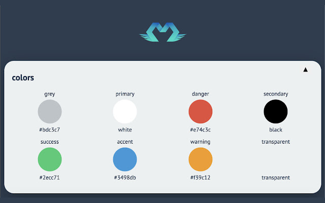

import Link from '@docusaurus/Link';

One of the most important feature of morfeo is the [dev-tool](https://chrome.google.com/webstore/detail/morfeo/phhhjdmeicikchjnpepljcdgbmipipcl),
with the dev tool you'll always be able to see your theme and play with it.



## Installation

You can install the dev tool by going to chrome web store and add it to your plugins:

<Link
  className="button button--primary button--lg"
  to="https://chrome.google.com/webstore/detail/morfeo/phhhjdmeicikchjnpepljcdgbmipipcl"
  style={{ color: 'white' }}
>
  💾 Install morfeo dev tool
</Link>

## Usage

Once you have done the installation, open the chrome devtool by inspecting the page or simply typing:
`alt + cmd + j`, you'll see a new tab called `Ⓜ️ Morfeo`:


Try it right now to see a sample theme provided by us!

## Enable Dev Tool in your application

Enable dev tool in your application it's pretty easy, just install `@morfeo/dev-tools`:

```bash
# npm
npm i @morfeo/dev-tools
# yarn
yarn add @morfeo/dev-tools
```

then in your app, just call the function `enableMorfeoDevTool`:

```typescript
import { enableMorfeoDevTool } from '@morfeo/dev-tools';
import { myTheme } from './myTheme';

enableMorfeoDevTool();

morfeo.setTheme('light', myTheme);
```

:::info
In a future release the dev tool will probably be always enabled by default
:::

## Contribute

We want to improve the dev tool as much as possible and add functionalities like:

- change the application theme from the dev tool
- increase the supported theme slices
- a UI to easily generate the style based on the theme
- handle multi-theming

If you want to help us, check our [GitHub](https://github.com/VLK-STUDIO/morfeo)!

If you want a particular functionality or you found a bug, please, open an issue [here](https://github.com/VLK-STUDIO/morfeo/issues)
