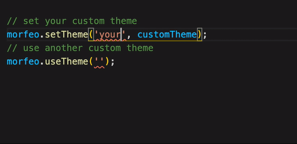

Morfeo natively support multi-theming, to add a new theme just call the method `setTheme` of `morfeo`:

```typescript
import { morfeo } from "@morfeo/core";
import { lightTheme, darkTheme, anotherTheme, ... } from "./themes";

morfeo.setTheme("light", lightTheme);
morfeo.setTheme("dark", darkTheme);
morfeo.setTheme("another", anotherTheme);
// ... You can add as many themes as you want
```

The first parameter is the name of the new theme and **must** be unique, the second parameter is the theme object.

After the themes are added, you can easily change the current theme by calling the methodd `usetTheme`:

```typescript
import { morfeo } from '@morfeo/core';

morfeo.useTheme('light');

console.log(morfeo.getCurrent()); // light;

const style = morfeo.resove({ color: 'background' }); // {color: "#ffffff"};

morfeo.useTheme('dark');

console.log(morfeo.getCurrent()); // dark;

const style = morfeo.resove({ color: 'background' }); // {color: "#000000"};
```

## Typescript

If you're using typescript you'll need to add your custom theme names by augmenting the interfaces `Themes`:

```typescript title="morfeo.d.ts"
declare module '@morfeo/core' {
  export interface Themes {
    yourCustomTheme: Theme;
    anotherCustomTheme: Theme;
  }
}
```


