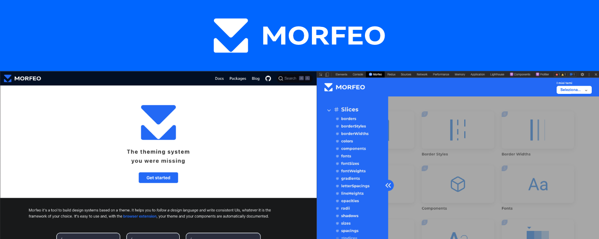
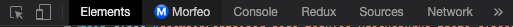

import { AddToChrome } from '../../src/components';

One of the most important feature of morfeo is the [Web Extension](https://chrome.google.com/webstore/detail/morfeo/phhhjdmeicikchjnpepljcdgbmipipcl).



With the extension you'll always be able to see your theme and play with it.

## Installation

You can install it by going to chrome web store and add it to your plugins:

<AddToChrome />

:::note Browser compatibility
It is also compatible with **Edge** and **Brave**, **Firefox** and **Safari** will soon be available
:::

## Usage

Once you have done the installation, open the chrome devtool by inspecting the page or simply typing:
`alt + cmd + j`, you'll see a new tab called `Ⓜ️ Morfeo`:



Try it right now in this website to see a sample theme provided by us!

## Use it in your application

Enable dev tool in your application it's pretty easy, just install `@morfeo/dev-tools`:

```bash
# npm
npm i @morfeo/dev-tools
# yarn
yarn add @morfeo/dev-tools
```

then in your app, just call the function `enableMorfeoDevTool`:

```typescript
import { enableMorfeoDevTool } from '@morfeo/dev-tools';
import { myTheme } from './myTheme';

enableMorfeoDevTool();

morfeo.setTheme('light', myTheme);
```

## Components customization

:::caution Use it with caution!
This feature is very helpful to present your components in a nice way but it will change the real component style.
So, use it consciously.
:::

Sometimes the style of a component couldn't be enough consistent to present it in a nice way inside the web extension.

```typescript
const Flex = {
  tag: 'div',
  style: {
    display: 'flex',
  },
};
```

In this case it could be needed to add an additional style, in order to present the component in a better way. You can use the `devtoolConfig` property inside `meta` to define these additional behaviors.

```typescript
const Flex = {
  tag: 'div',
  style: {
    display: 'flex',
  },
  meta: {
    devtoolConfig: {
      label: 'Flex Div',
      style: {
        size: '100px',
        bg: 'gray.light',
      },
      background: 'white',
    },
  },
};
```

### devtoolConfig Props

| prop       | description                                                     | type                                                                 |
| ---------- | --------------------------------------------------------------- | -------------------------------------------------------------------- |
| label      | the text used as component children in the web extension        | `string`                                                             |
| style      | the default style of the component in the web extension         | `Style`                                                              |
| background | the default background for the card that contains the component | `Color` `Record<string, Color>` (where the string is the theme name) |

## Contribute

We want to improve the web extension as much as possible and add functionalities, If you want to help us, check our [GitHub](https://github.com/morfeojs/morfeo)!

If you want a particular functionality or you found a bug, please, open an issue [here](https://github.com/morfeojs/morfeo/issues)
